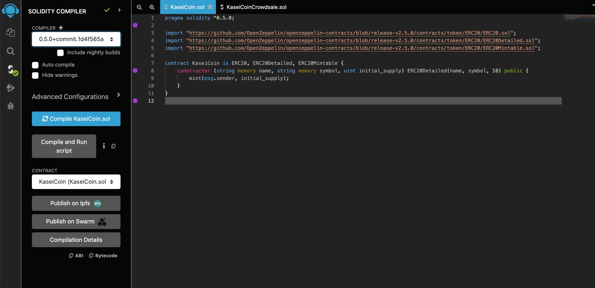
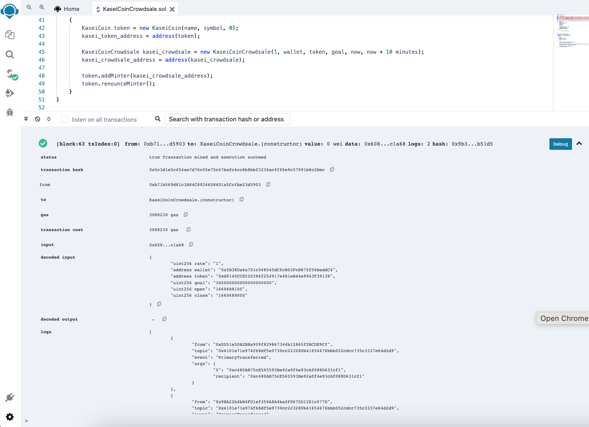

# KAI Coin crowdsale

The goal of this project is to deploy a **crowdsale** contract for a token. I imported contracts for Crowdsale, MintedCrowdsale, CappedCrowdsale, TimedCrowdsale and RefundablePostDeliveryCrowdsale from open zeppelin. The crowdsale is to be deployed with a rate of 1, where one token equal one Wei. The goal if to reaise **300 Ether**. For demonstration purposes the crowdsale is timed to now + 10 minutes, where now is the block time when the contract is deployed. 

I first deployed the `KaseiCoin.sol` contract which is the ERC20 token contract. Here is a successful compilation of the contract. 

I then compiled and successfully deployed my crowdsale smart contract. Heres is the confirmations.

