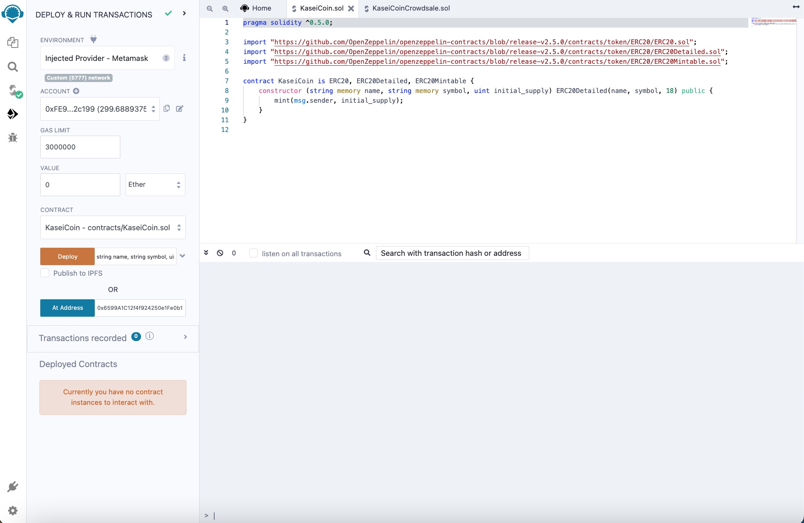
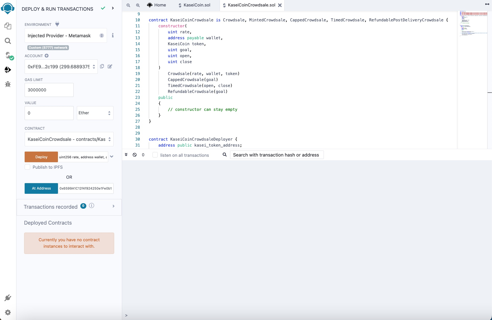

# KAI Coin crowdsale

The goal of this project is to deploy a **crowdsale** contract for a token. I imported contracts for Crowdsale, MintedCrowdsale, CappedCrowdsale, TimedCrowdsale and RefundablePostDeliveryCrowdsale from open zeppelin. The crowdsale is to be deployed with a rate of 1, where one token equal one Wei. The goal if to reaise **300 Ether**. For demonstration purposes the crowdsale is timed to now + 10 minutes, where now is the block time when the contract is deployed. 

### KaseiCoin ERC20 contract compiled ✅
I first deployed the `KaseiCoin.sol` contract which is the ERC20 token contract. Here is a successful compilation of the contract. 

### KaseiCoinCrowdsale Contract compiled ✅
I then compiled and successfully deployed my `KaseiCoincrowdsale.sol` smart contract. Heres is the confirmations.

## CrowdsaleDeployer Contract deployed and walkthrough interaction (Video)

> Above here you will see walkthrough. Wait for about **30 seconds** as it takes time for it to load on github. 

I am able to deploy `KaseiCoinCrowdsaleDeployer` which after deploying I can call `kasei_crowdsale_address` and `kasei_token_address` from the depployer to recieve the contract address to interact with my KAI token. I then selected my contracts and added the addresses to view and intereact with them in the editor configuration with the addresses. I confirm that `isOpen` is **true** and proceed to buy **50 Ether** with the first account as the beneficiary, then, another **250 Ether** with a second test account using injected metamask. I check and confirm that `goalReached` is **true** and call `weiRaised` to confirm amount raised. I confirm that the `closingTime` has reached in order to call `finalized` for the crowdsale. I make sure to import the **KAI** token to my metamask. After, I call `finalize`. To withdraw tokens, call `withdrawTokens` by adding the beneficiary address. KAI tokens are withdrawn to the address and the **300 Ether** that was raised will be sent to the crowsale payable address. I check metamask to verify that **250 KAI** was deposited to the second account and **50 KAI** was deposited in the first account. Going back to the `KaseiCoin` contract address we can call `totalSupply` and we see `300000000000000000000` KAI is our new token supply. 
 